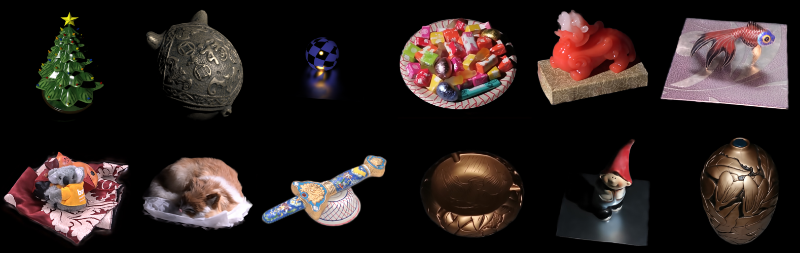

# DeferredNeuralLighting

Source code of our paper:

Deferred Neural Lighting: Free-viewpoint Relighting from Unstructured Photographs

> Duan Gao, Guojun Chen, Yue Dong, Pieter Peers, Kun Xu, Xin Tong <br />
> SIGGRAPH Asia 2020



**More information (including our paper, supplementary, video and slides) can be found at [My Personal Page](https://gao-duan.github.io/).**

If you have any questions about our paper, please feel free to contact me (gao-d17@mails.tsinghua.edu.cn)


## Dependencies

- Python (with opencv-python, numpy, tqdm, imageio-ffmpeg; test on Python 3.6)
- Tensorflow-gpu (test on tensorflow=1.12.0)


## Pretrained models & Dataset

We released the dataset and pretrained models of all synthetic scenes (Christmas tree, sphere, pig head) and two real captured scenes (Pixiu statuette, cluttered scene).


### Dataset

- Testing dataset

  including both testing data under point lighting and environment lighting.
  
- Training dataset

  including the point lighting training dataset (already packed based view partition). 

[Download dataset](dataset_urls.md)

### Pretrained models

The pretrained models that we released are the final version (after the lighting augmentation training). Both point lighting and environment lighting are supported.

You can download the pretrained models from: 

[Models](http://share.msraig.info/DeferredNeuralLighting/models.zip) [Models_mask](http://share.msraig.info/DeferredNeuralLighting/models_mask.zip)


## Usage


### Testing

`src/test_cluster.py`:  generate the raw outputs (without masking the background area)

`src/test_mask.py`:  generate mask images and apply them to the raw outputs (This step is only neccessary for enviroment lighting data)


For more details, please refer to `scripts/test/*.bat`.


### Training

- Training with point lighting data

    Please refer to `scripts/train/train_point_light_example.py`

- Classic image based rendering

    For the details about classic image based rendering, please refer to our paper.

    After the image-based rendering, the renderered images generated by image-based rendering and other rendered data (e.g. radiances cues, uv map) should be packed based on view partition.
    (In our implementation, we use 13 view partiions, please refer to `preprocess/view_partition_60degree.obj`)

- Training with both point lighting data and augmentated data 

    Please refer to `scripts/train/train_augmentation_example.py`


### Others

- `preprocess/imgs2video.py`: 

  combine multiple images to video

- `preprocess/pack_dataset.py`: 

    packing raw data into tfrecords

- `prepeocess/unpack_dataset.py`: 

    unpacking from tfrecords into raw data

## Citation

If you use our code or dataset or pretrained models, please cite as following:

```
@article{gao2020deferred,
  title={Deferred neural lighting: free-viewpoint relighting from unstructured photographs},
  author={Gao, Duan and Chen, Guojun and Dong, Yue and Peers, Pieter and Xu, Kun and Tong, Xin},
  journal={ACM Transactions on Graphics (TOG)},
  volume={39},
  number={6},
  pages={258},
  year={2020},
  month={December},
  publisher={ACM}
}
```

